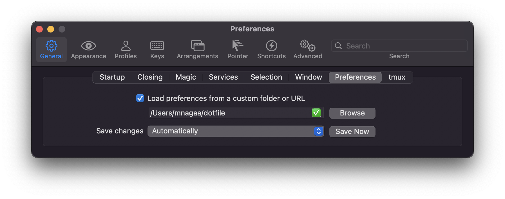

# dotfile

```shell
$ make mac-setting
$ make linux-setting
```

## p10k

- 変更する時
```shell
> p10k configure
```

## Vim Setup

### setup font

1. Download font file from https://github.com/yumitsu/font-menlo-extra/blob/master/Menlo-Regular-Normal.ttf.
2. Open file and 'Install font'.
3. Go to preference of your terminal > profile > text > font > choose 'Menro Nerd Font'

## Homebrew

### Install from brewfile

`brew bundle`

### Dump to brewfile

`brew bundle dump`

## iterm2

### setup

1. Preferences > General > Preferences
2. Check: `Load prederences from custom forlder or URL.'


